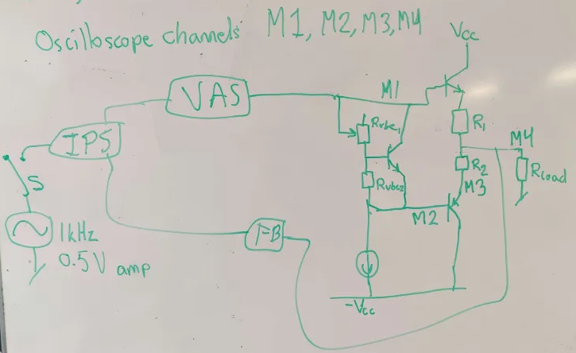

# Transistor bias measurements

## Purpose

The PNP power transistor burns/breaks when the biasing is to high (read correct)
therefore a lab test will be done to  

## Method
a 4 channel oscilloscope will be used to measure the base voltage on both of the power transistor, the output of the amplifier and below $R_{2}$ (the PNP thermal runaway transistor)

Therefore the:
- Voltage between the bases can be measured.
- The power through the thermal runaway transistor can be calculated and.
- The output of the amplifier can be measured.
- The circuit can be checked for self oscilation by looking at M1

## Results

- 3.5V between the bases when potmeter is at  $R_{vbe2}=3.35K\Omega$ and $R_{vbe1}=1k\Omega$
- about 20 mA through the $R_{2}$

- no self oscilation was observed

