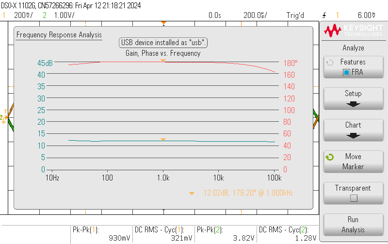
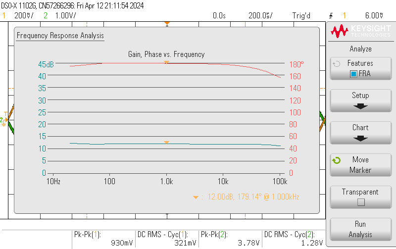

# Class A Test Journal

## Reasons
* Verify uniform gain across the frequency range of 20Hz to 20kHz.
* Affirm the THD of the system. 
* Validate input and output impedance is in accordance with requirements.

## Methods

## Results

THD:
Input Z:
Output Z:
snr:

### Frequency responce

## Conclusion