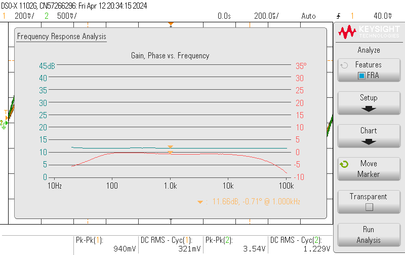
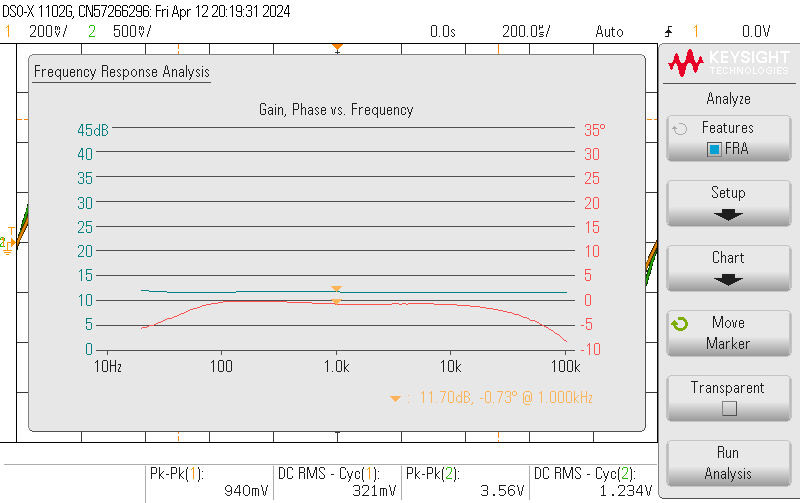

# Non Inverting OP-Amp Test Journal

## Reason
* Verify uniform gain across the frequency range of 20Hz to 20kHz.
* Affirm the THD of the system. 
* Validate input and output impedance is in accordance with requirements.

## Method
The frequency response of the system is measured with an oscilloscope.

For THD, input impedance and output impedance pc "insert name" is used according to its setup procedure.

## Result

THD:
Input Z:
Output Z:
snr:

### Frequency responce

## Conclusion

