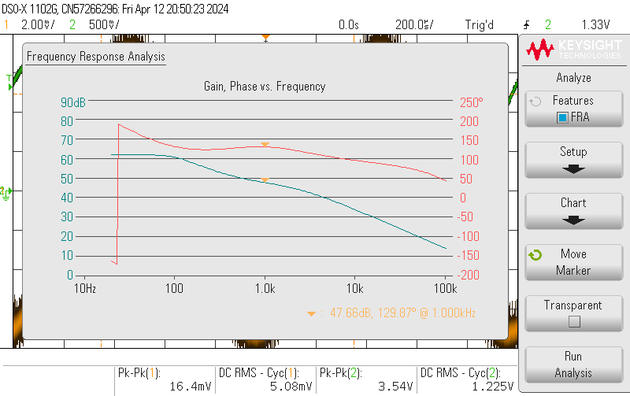
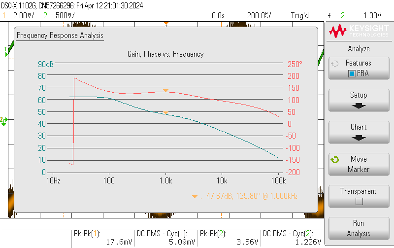

# RIAA and Inverting OP-Amp Test Journal 

## Reason
* Ensuring compliance with the standard RIAA transfer function and chosen gain at 1kHz.
* Validating correct input and output impedance.

## Method

Perform a frequency response with the oscilloscope and record the data and affirm 

## Result

THD:
Input Z:
Output Z:
snr:

### Frequency response

Output from RIAA and inverting opamp

## Conclusion

