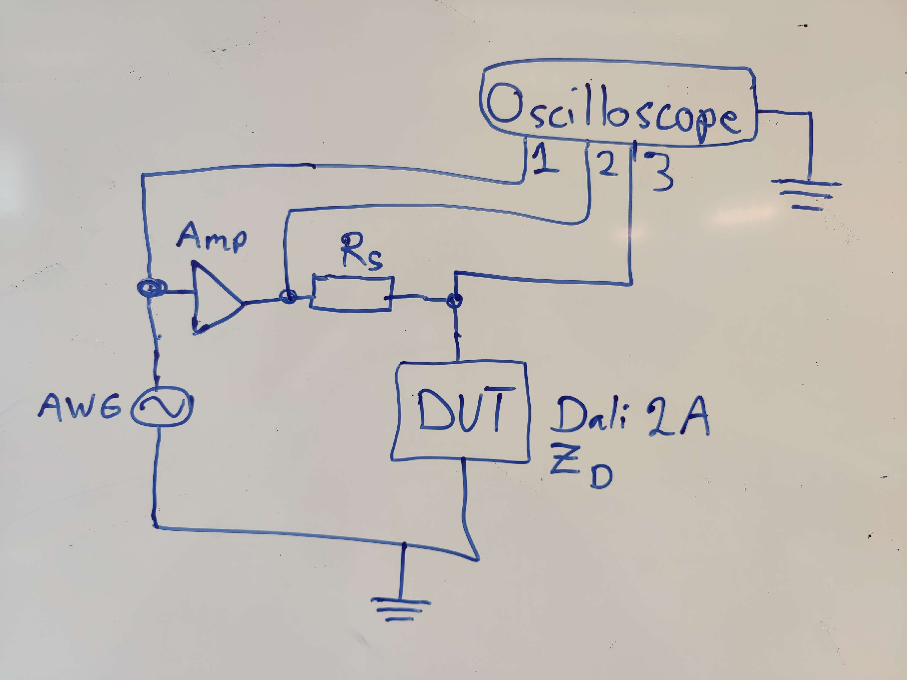
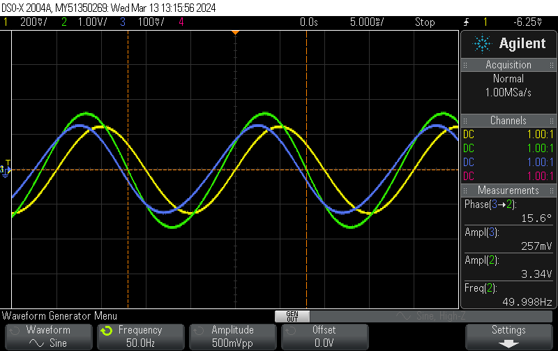
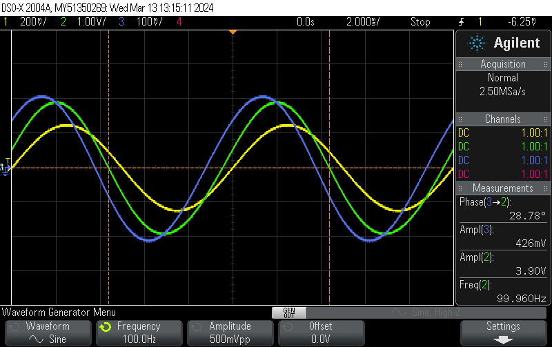
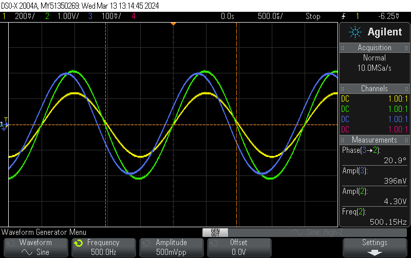
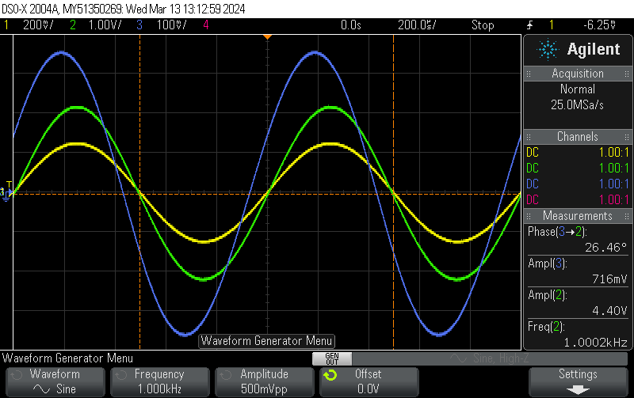
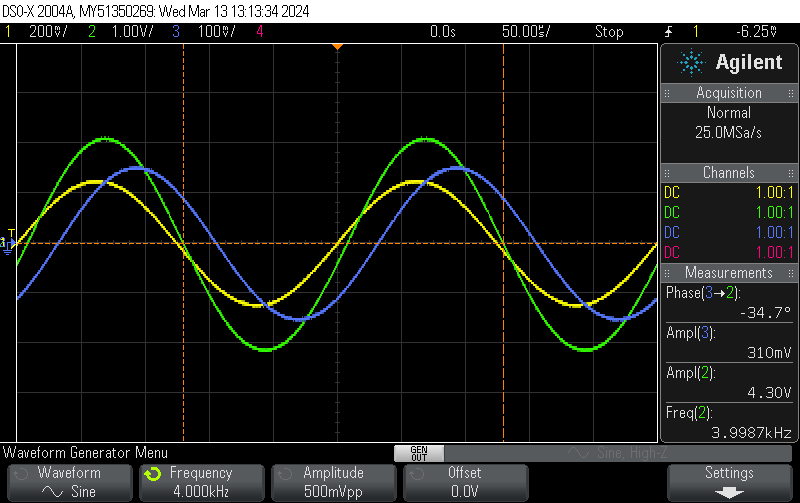
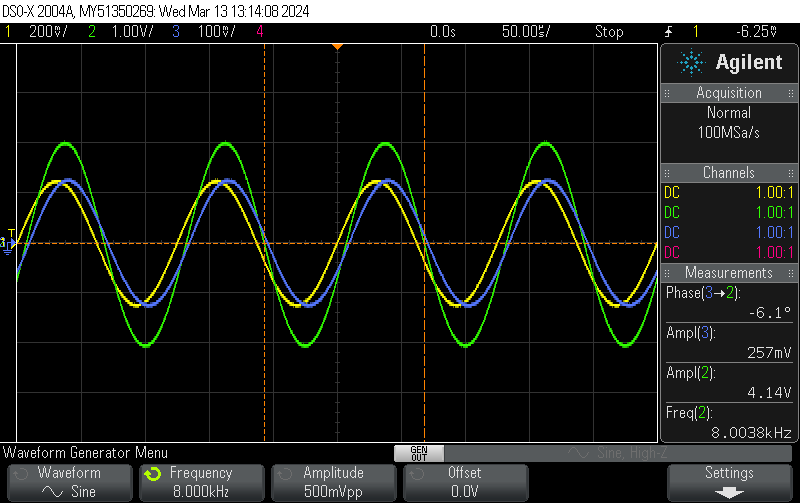
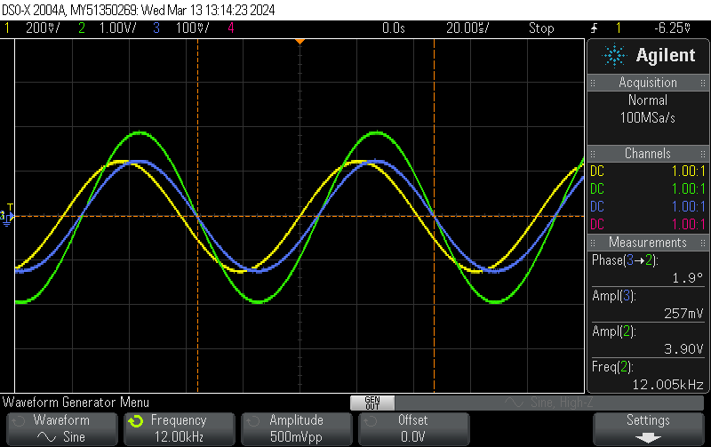

# Purpose

The purpose of this test is to characterize the impedance of the Dali 2A speaker.

# Method



- Create the test setup shown in the figure.
- Input sine waveforms with frequencies 50Hz, 100Hz, 500Hz, 1kHz, 4kHz, 8kHz, and  12kHz.
- Calculate complex impedance at the input frequencies.
- Calculate capacitance/inductance from impedance.

# Results









# Calculation

```py
from math import *
from cmath import *

def Z(R_s, div):
    return -div*R_s/(div - 1)

def L_D(R_s, div1, div2, f1, f2):
    w1 = 2 * pi * f1
    w2 = 2 * pi * f2
    return (-1j) * R_s * (div1 - div2) / ((w1*div2 - w2*div2 - w1 + w2) * (div1 - 1))

def R_D(R_s, div1, div2, f1, f2):
    w1 = 2 * pi * f1
    w2 = 2 * pi * f2
    return -R_s * (div1*div2*w1 - div1*div2*w2 + div1*w2 - w1*div2) / ((w1*div2 - w2*div2 - w1 + w2)*(div1-1))

R_s = 100  # ohm
divs = [rect(0.257/3.34, radians(15.6)), rect(0.426/3.9, radians(28.78)), rect(0.396/4.3, radians(20.9)), rect(0.716/4.4, radians(26.46)), rect(0.310/4.3, radians(-34.7)), rect(0.257/4.14, radians(-6.1)), rect(0.257/3.9, radians(1.9))]
fs = [50, 100, 500, 1e3, 4e3, 8e3, 12e3]
for f, div in zip(fs, divs):
    print(f, Z(R_s, div))
```
